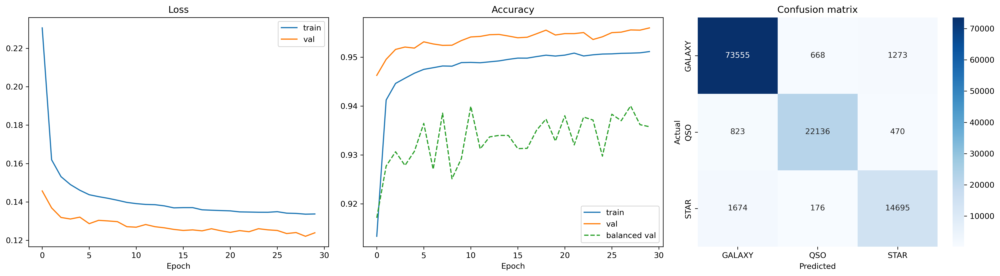

# Astronomical Object Classification with PyTorch

A PyTorch-based neural network for classifying astronomical objects from the Sloan Digital Sky Survey (SDSS) Data Release 17 dataset.

The model predicts one of three classes:

* Star
* Galaxy
* Quasar

## Project Overview

Astronomical surveys collect vast amounts of observational data about celestial objects. Identifying whether an object is a star, galaxy, or quasar is a fundamental classification task in astronomy.

This project explores the use of a feed-forward neural network built with PyTorch to perform multiclass classification on SDSS DR17 data.

## Dataset

**Source:** Sloan Digital Sky Survey (SDSS) Data Release 17

The dataset contains observational measurements of astronomical objects along with their corresponding labels.

Classes:

* Star
* Galaxy
* Quasar

Dataset files are not included in this repository.

## Model Architecture

A fully connected feed-forward neural network implemented in PyTorch.

Architecture:

* Input Layer
* Hidden Layer(s) with ReLU activations
* Output Layer with 3 neurons (one for each class)

Training Configuration:

* Framework: PyTorch
* Loss Function: CrossEntropyLoss
* Optimizer: Adam
* Task: Multiclass Classification
* Epochs: 30

## Results
After 30 epochs


| Metric | Value |
|----------|----------|
| Validation Accuracy | 95.6% |
| Balanced Accuracy | 93.6% |
| Validation Loss | 0.123 |

The model demonstrates strong performance in distinguishing between stars, galaxies, and quasars while maintaining balanced performance across all classes.

## What I Learned

Through this project I gained hands-on experience with:

* Building neural networks using PyTorch
* Working with tabular datasets
* Data preprocessing and feature preparation
* Training and validation workflows
* Multiclass classification problems
* Model evaluation using accuracy and balanced accuracy

## Repository Structure

```text
.
├── images/
│   └── results.png
├── notebook.ipynb
├── train.py
├── requirements.txt
├── README.md
└── .gitignore
```

## Technologies Used

* Python
* PyTorch
* NumPy
* Pandas
* Jupyter Notebook

## Future Improvements

* Hyperparameter tuning
* Deeper neural network architectures
* Feature importance analysis
* Comparison with traditional machine learning models
* Experimentation with ensemble methods

## Author

Adhik Puthenkattil
